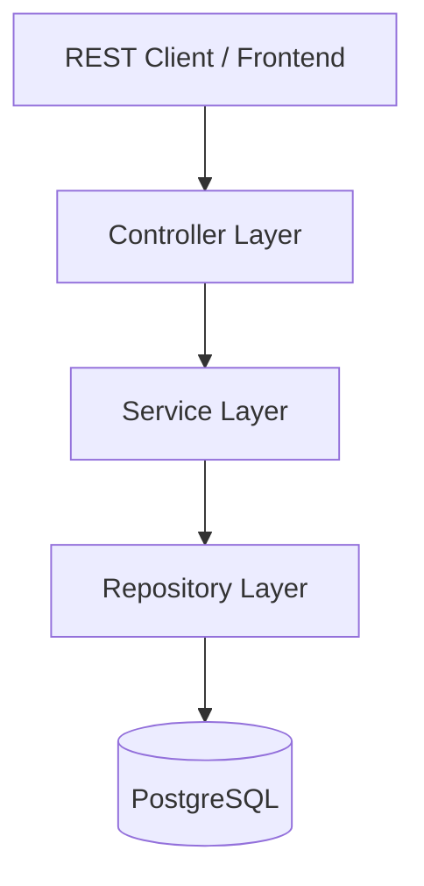
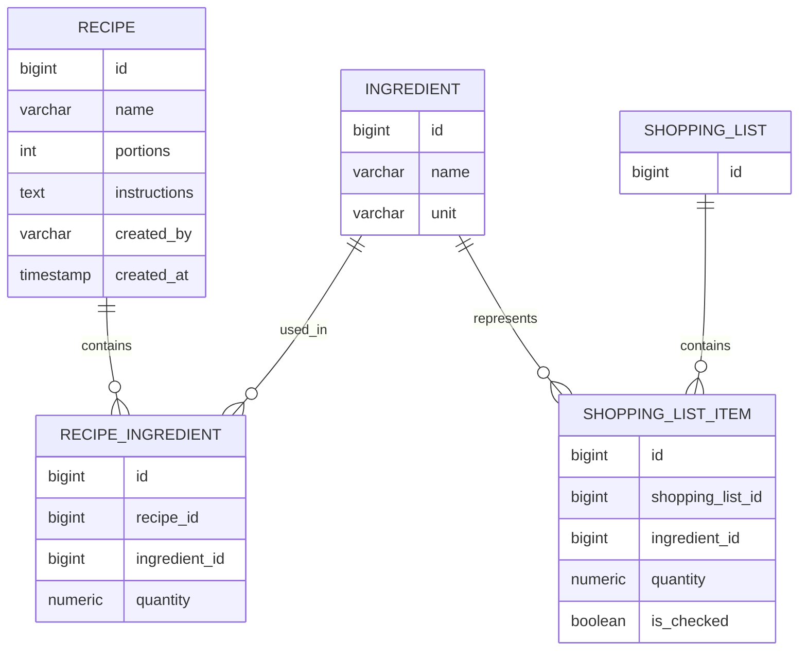

# Recipe App Backend 🍳

A Spring Boot REST API for managing recipes and generating consolidated shopping lists from multiple recipes.

This project is the backend for a recipe-planning application I am building to make meal planning and grocery shopping easier. Recipes can be stored with their ingredients, quantities and instructions, and multiple recipes can then be combined into a single shopping list with duplicate ingredients automatically consolidated.

The project is built with a focus on clean backend architecture, relational data modelling, REST API design, automated testing and containerised local development.

## Running the Application

### Prerequisites

The easiest way to run the project is with Docker and Docker Compose.

You can also run the Spring Boot application directly with Java and Maven if you have PostgreSQL running locally.

### Run with Docker Compose

Clone the repository:

```bash
git clone https://github.com/Neutralas/recipe-app.git
cd recipe-app
```

Start the application and PostgreSQL:

```bash
docker compose up --build
```

This starts:

```text
Recipe App       → http://localhost:8080
PostgreSQL       → localhost:5432
```

The PostgreSQL container is configured with:

```text
Database: recipe_app
Username: recipe_app
Password: recipe_app_password
```

Flyway runs the database migrations when the application starts.

To stop the application:

```bash
docker compose down
```

To stop the application and remove the persisted PostgreSQL volume:

```bash
docker compose down -v
```

## Features

### Recipe management

* Create recipes with:

  * Name
  * Number of portions
  * Ingredients and quantities
  * Preparation instructions
  * Creator
* Retrieve a single recipe
* Retrieve all recipes
* Reuse existing ingredients instead of creating duplicate ingredient records

### Shopping lists

* Build a shopping list from multiple recipe IDs
* Automatically combine identical ingredients
* Sum quantities across selected recipes
* Retrieve a previously generated shopping list
* Retrieve all shopping lists
* Track whether a shopping-list item has been checked

### Example

Given:

**Recipe 1 — Pasta**

* 200 g pasta
* 100 g tomatoes

**Recipe 2 — Tomato Soup**

* 300 g tomatoes
* 1 clove garlic

The generated shopping list becomes:

* 200 g pasta
* 400 g tomatoes
* 1 clove garlic

This aggregation is handled in the service layer using the ingredient ID as the grouping key.

## Tech Stack

| Technology      | Purpose                                  |
| --------------- | ---------------------------------------- |
| Java 21         | Programming language                     |
| Spring Boot     | Application framework                    |
| Spring Web      | REST API                                 |
| Spring Data JPA | Persistence and repository abstraction   |
| PostgreSQL      | Relational database                      |
| Flyway          | Database migrations                      |
| Bean Validation | Request validation                       |
| Lombok          | Boilerplate reduction                    |
| JUnit 5         | Testing                                  |
| Mockito         | Unit testing and mocking                 |
| Spring MockMvc  | Controller/API testing                   |
| Maven           | Build and dependency management          |
| Docker          | Containerisation                         |
| Docker Compose  | Local application + database environment |

## Architecture

The application follows a layered architecture:



The codebase is organised into clear responsibilities:

```text
src/main/java/com/example/recipe_app
├── config
├── controller
│   ├── RecipeController
│   └── ShoppingListController
├── dto
│   ├── Request DTOs
│   └── Response DTOs
├── entity
│   ├── Recipe
│   ├── Ingredient
│   ├── RecipeIngredient
│   ├── ShoppingList
│   ├── ShoppingListItem
│   └── Unit
├── exception
├── mapper
├── repository
└── service
    ├── RecipeService
    └── ShoppingListService
```

Controllers are responsible for exposing HTTP endpoints, services contain the application/business logic, repositories handle persistence through Spring Data JPA, and DTOs/mapper classes keep the API representation separate from the persistence model.

## Data Model

The application uses PostgreSQL with a normalised relational model.



A separate `RecipeIngredient` entity is used to model the relationship between recipes and ingredients while storing the quantity required by each recipe.

Ingredient names are unique at the database level, which allows recipes to reference the same ingredient rather than creating duplicate records.

Quantities use `BigDecimal`/`NUMERIC` rather than floating-point values so that measurements can be represented without floating-point rounding issues.

## REST API

The backend currently exposes two main resources.

### Recipes

#### Create a recipe

```http
POST /recipes
Content-Type: application/json
```

Example request:

```json
{
  "name": "Tomato Pasta",
  "portions": 2,
  "ingredients": [
    {
      "name": "pasta",
      "quantity": 200,
      "unit": "GRAM"
    },
    {
      "name": "tomatoes",
      "quantity": 300,
      "unit": "GRAM"
    }
  ],
  "instructions": "Cook the pasta and combine with the tomatoes.",
  "createdBy": "Simon"
}
```

Returns `201 Created`.

#### Get all recipes

```http
GET /recipes
```

#### Get a recipe

```http
GET /recipes/{id}
```

### Shopping lists

#### Build a shopping list

```http
POST /shopping-lists
Content-Type: application/json
```

Example request:

```json
{
  "recipeIds": [1, 2, 5]
}
```

The backend retrieves the ingredients belonging to the selected recipes and combines quantities for matching ingredients.

Returns `201 Created`.

#### Get a shopping list

```http
GET /shopping-lists/{id}
```

#### Get all shopping lists

```http
GET /shopping-lists
```

## Business Logic

The main piece of application logic is shopping-list generation.

When a set of recipe IDs is supplied, the service retrieves all associated `RecipeIngredient` records in a single repository query. The ingredients are then grouped by ingredient ID and their quantities are summed.

Conceptually:

```text
Recipe IDs
    ↓
Recipe ingredients
    ↓
Group by ingredient
    ↓
Sum quantities
    ↓
Shopping list items
    ↓
Persist shopping list
```

For example:

```text
Recipe A:
    Onion 100 g
    Tomato 200 g

Recipe B:
    Onion 150 g
    Garlic 1 clove

                ↓

Shopping List:
    Onion 250 g
    Tomato 200 g
    Garlic 1 clove
```

This keeps the aggregation logic in the service layer rather than coupling it to the controller or database representation.

## Database Migrations

Database schema changes are managed with Flyway rather than relying on Hibernate to create or modify the schema.

The current migration creates the core recipe, ingredient, recipe-ingredient, shopping-list and shopping-list-item tables, including foreign-key relationships and database constraints. Hibernate is configured with `ddl-auto=validate`, so the application validates the schema rather than modifying it at runtime.

```text
src/main/resources/db/migration/
└── V1__create_initial_schema.sql
```

## Testing

The project includes both service-layer unit tests and web-layer tests.

### Service tests

The service tests cover scenarios including:

* Creating recipes with new ingredients
* Creating recipes using existing ingredients
* Creating recipes without ingredients
* Retrieving existing recipes
* Handling missing recipes
* Combining duplicate ingredients in shopping lists
* Handling shopping lists with no duplicate ingredients
* Handling an empty recipe selection
* Retrieving existing shopping lists
* Handling missing shopping lists

The shopping-list aggregation logic is specifically tested to ensure quantities are correctly combined. For example, duplicate ingredient quantities of `1` and `10` are expected to produce `11`.

### Controller tests

The REST controllers are tested with `@WebMvcTest` and `MockMvc`.

The tests verify:

* HTTP status codes
* JSON responses
* Request handling
* Successful recipe creation and retrieval
* Successful shopping-list creation and retrieval
* `404 Not Found` behaviour
* Empty collection responses

To keep controller tests isolated, service dependencies are mocked rather than accessing the database.

## Project Status

This repository currently contains the backend foundation of the recipe application.

The core recipe-management and shopping-list workflows are implemented and covered by automated tests. The project is being developed incrementally with the goal of eventually supporting a complete meal-planning application.

## Future Improvements

This project is actively being developed. Planned improvements include:

* User authentication and authorisation
* Recipe update and deletion endpoints
* Shopping-list item update/check endpoints
* Meal planning and calendar-based organisation
* Recipe scaling based on number of portions
* Improved ingredient/unit handling
* Pagination and filtering for larger recipe collections
* API documentation with OpenAPI/Swagger
* Integration tests against PostgreSQL
* CI/CD pipeline
* Production deployment

## Why I Built This

I wanted to solve a real problem I encounter when planning meals: choosing several recipes and manually working out which ingredients I need to buy.

Rather than treating the project as a simple CRUD exercise, I used it to explore backend concerns such as:

* Designing a relational domain model
* Structuring a Spring Boot application into separate layers
* Designing REST endpoints and API DTOs
* Managing database schema evolution
* Implementing non-trivial business logic
* Handling relationships with JPA
* Writing isolated unit tests and controller tests
* Running the application and database in containers

The project is intended to evolve alongside the frontend into a complete recipe and meal-planning application.
